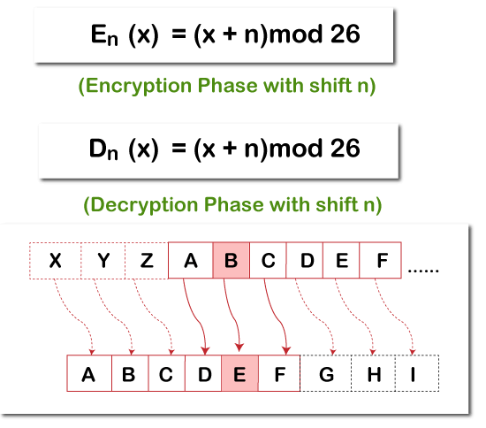

<h1>Ceasar Cipher Encrypt/Decrypt</h1>

This is a simple Python program that demonstrates Ceasar Cipher encryption and decryption.

<h2>How to use</h2>

<ol>
  <li>Run the program using Python.</li>
  <li>Enter the text you want to encrypt or decrypt.</li>
  <li>Enter the key for the cipher.</li>
  <li>Select whether you want to encrypt or decrypt.</li>
  <li>Click the "Encrypt" or "Decrypt" button.</li>
  <li>The result will be displayed below.</li>
</ol>

<h2>Example output</h2>

<h2>License</h2>

This project is licensed under the MIT License - see the <a href="LICENSE.md">LICENSE.md</a> file for details.

